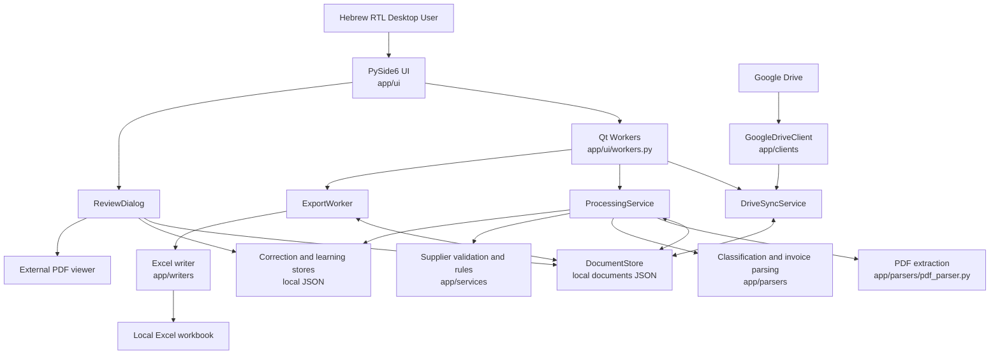

# Panda Architecture

This document describes the current implementation. The final Panda 2.0 architecture has not been selected.

## Overview

Panda is a local Python/PySide6 desktop monolith with internal layers. It has no server and no database. Google Drive is the remote source of PDFs; local JSON and filesystem files are the system of record; Excel is the primary output.

The active desktop process combines UI, background workers, workflow services, parsing, persistence, and export in one Python runtime. A separate legacy CLI pipeline remains in the repository.

## Architecture Diagram

## Layers

### Presentation Layer

`app/ui/` contains the desktop shell, pages, dialogs, styling, and user-action handlers.

- `app/ui/main_window.py` constructs navigation, tables, filters, dashboard content, context menus, toolbar actions, and most workflow commands.
- `app/ui/review_dialog.py` presents extracted data and raw text, opens the source PDF externally, accepts corrections, permits status selection, persists changes, and invokes learning behavior.
- `app/ui/progress_dialog.py` shows background-task progress and logs.
- `app/ui/dashboard_widget.py` renders dashboard summary content.
- `app/ui/sidebar_widget.py` implements the fixed navigation sidebar.
- `app/ui/workers.py` adapts synchronous services to Qt background execution.

The presentation layer depends directly on models, persistence, services, status labels, and local file-opening behavior.

### Worker / Background Execution

`app/ui/workers.py` defines Qt workers used for Drive scanning, processing, retries/reprocessing, and export. Workers emit progress, status, completion, and failure signals to the UI. The model is asynchronous relative to the UI event loop but remains in the local desktop process.

### Services / Workflow

`app/services/` coordinates application workflows:

- `drive_sync_service.py` recursively maps Drive PDFs into local document records and detects new or changed files.
- `processing_service.py` downloads, extracts, classifies, parses, validates, scores, detects duplicates, updates statuses, and persists results.
- `duplicate_detection_service.py` determines possible duplicate relationships.
- `exclusion_service.py` manages irrelevant/excluded Drive IDs and local deletion.
- correction, learning, confidence, and supplier-related services support parsing decisions and manual feedback.

These modules form a logical service layer, but workflow policy is also implemented in UI handlers.

### Domain Model

`app/models/document.py` defines the active `Document` dataclass, its serialized fields, workflow status constants, effective corrected values, duplicate flags, export fields, and lifecycle timestamps.

The active model is data-centric. It does not enforce allowed status transitions.

### Parsing

`app/parsers/` contains PDF text extraction and RTL normalization, document classification, invoice-field parsing, confidence-related extraction metadata, and learned parsing behavior. `app/parsers/invoice_parser.py` is a central implementation point for invoice fields and is being preserved as the current parser baseline.

### Google Drive Integration

`app/clients/` contains the Google Drive API boundary. It authenticates with a local service-account credential file, lists folders and PDFs recursively, reads metadata, and downloads file bytes. The requested API scope is read-only.

### Persistence

`DocumentStore` in `app/services/document_store.py` serializes the active `Document` collection to local JSON. Other local JSON files hold corrections, learned rules, supplier rules, exclusions, and legacy CLI state. PDFs, extracted text, and Excel output also live on the local filesystem.

Persistence is not transactional. Runtime locations are described in [Operations](OPERATIONS.md), and fields and statuses are described in [Data Model](DATA_MODEL.md).

### Export

`ExportWorker` in `app/ui/workers.py` selects approved records, calls the writer, and advances them to `exported`. `app/writers/excel_writer.py` reads or creates the workbook and writes tabular invoice data using pandas/openpyxl.

### Configuration

`app/config.py` loads local environment configuration and defines repository-relative runtime paths. The supported environment-variable names are documented in [Operations](OPERATIONS.md). No settings UI exists.

### Legacy CLI

`app/main.py` is a legacy command-line entry point. It uses the legacy `app/models/record.py` model and `app/state/state_manager.py` persistence/status system rather than the active desktop `Document` pipeline.

The CLI overlaps conceptually with Drive discovery, parsing, state, and export but does not share the desktop application's complete state model. Whether it remains supported is an open Panda 2.0 decision.

## Current Coupling / Architecture Debt

- `app/ui/main_window.py` is a large class combining layout, filtering, table projection, status presentation, background-task orchestration, persistence access, and workflow policy.
- The UI contains rules for retry, approval, irrelevant handling, duplicate resolution, and export eligibility rather than delegating all policy to a central workflow service.
- `app/ui/review_dialog.py` writes directly to persistence and learning/correction stores.
- Status definitions, labels, eligibility checks, and transitions are distributed across models, services, dialogs, and the main window.
- `app/ui/dashboard_widget.py` depends on status labels defined in `app/ui/main_window.py`, coupling a reusable view to the shell.
- Active desktop and legacy CLI pipelines overlap without a single shared domain or transition model.

These are confirmed current-state observations. They are not changes made by this documentation baseline.

## Panda 2.0 Architectural Questions

The following are open questions, not accepted decisions:

- Keep, replace, or retire the legacy CLI?
- Continue with JSON or migrate to SQLite?
- Introduce a central workflow/state-transition service?
- Keep repository-relative runtime data or move it to an application-data location?
- Introduce explicit schema version validation and migrations?
- Add a Drive gateway/repository abstraction?
- Add an export abstraction beyond the current Excel implementation?
- Add an explicit audit-event model?

Future decisions should be recorded through the [ADR process](decisions/README.md) before implementation.
