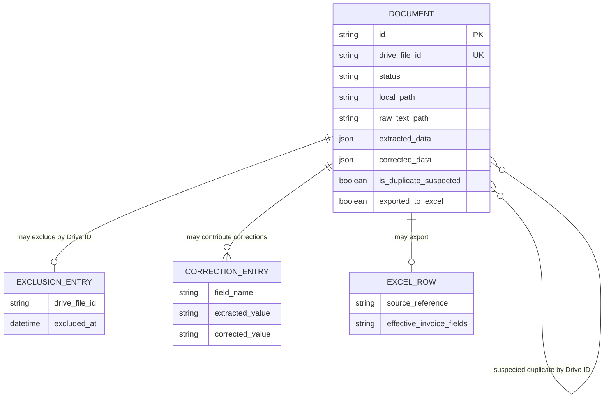

# Panda Data Model

This document describes the current active desktop model and auxiliary runtime persistence. It does not prescribe a Panda 2.0 storage design.

## Primary Entity — Document

`Document` is a dataclass defined in `app/models/document.py`. One record represents one Google Drive PDF and its local processing lifecycle. `DocumentStore` in `app/services/document_store.py` serializes records to JSON.

### Identity

| Field | Meaning |
| --- | --- |
| `id` | Locally generated UUID for the document record. |
| `drive_file_id` | Google Drive file ID; used for synchronization lookup and most UI/service references. |

### Drive Metadata

| Field | Meaning |
| --- | --- |
| `file_name` | Current filename reported by Drive. |
| `folder_path` | Reconstructed relative Drive folder path. |

Drive modification time is used during scanning but is not stored as a dedicated model field. The scanner compares it to local `updated_at`.

### Local File References

| Field | Meaning |
| --- | --- |
| `local_path` | Path to the locally downloaded source PDF. |
| `raw_text_path` | Path to the locally saved extracted-text file. |

### Workflow

| Field | Meaning |
| --- | --- |
| `status` | Primary workflow status string. |
| `confidence` | Parser/validation confidence from 0.0 to 1.0. |
| `error_message` | Processing error or automatic-skip reason. |

### Invoice Fields

| Field | Meaning |
| --- | --- |
| `supplier_name` | Parsed supplier/business name. |
| `invoice_number` | Parsed document/invoice identifier. |
| `invoice_date` | Parsed date string. |
| `subtotal` | Subtotal when populated. |
| `vat` | VAT when populated. |
| `total` | Total amount used by the active processing/export flow. |
| `description` | Optional description. |

No explicit currency field exists.

### Parsing Metadata

`extracted_data` stores the parser result and metadata. Current parser keys include document type, business/supplier name, invoice date, invoice number, amount, and supplier-validation details. The structure is flexible rather than a separately versioned schema.

### Corrected Data

- `corrected_data` stores user-entered values keyed by field name.
- `was_manually_corrected` indicates that a manual correction was recorded.
- `Document.effective(field_name)` returns a corrected value when that key exists and is neither `None` nor an empty string; otherwise it falls back to the dataclass field.

This fallback means an extracted value cannot currently be intentionally replaced by a clean empty value through `effective()`.

### Duplicate State

| Field | Meaning |
| --- | --- |
| `is_duplicate_suspected` | Routes a record to attention without replacing its primary status. |
| `duplicate_confidence` | Secondary classification: `exact`, `high`, or empty. |
| `suspected_duplicate_of` | List of matching records referenced by Google Drive file ID. |

Duplicate indicators are flags/secondary state, not primary workflow statuses.

### Export State

- `exported_to_excel` is a boolean export marker.
- `status = "exported"` is also assigned after successful export.

The status and boolean duplicate the export fact and are maintained procedurally by `ExportWorker`.

### Irrelevant / Exclusion State

- `confirmed_irrelevant_at` records the explicit confirmation time.
- `confirmed_irrelevant` is the current user-confirmed primary status.
- `excluded` is a legacy equivalent retained on old records.
- The separate excluded-file registry prevents a confirmed Drive ID from being rediscovered.

### Timestamps

| Field | Meaning |
| --- | --- |
| `created_at` | UTC ISO timestamp created with the local record. |
| `updated_at` | UTC ISO timestamp refreshed by `touch()` during store upsert. |
| `confirmed_irrelevant_at` | UTC timestamp for explicit irrelevant confirmation, when assigned. |

There are no dedicated processed, reviewed, approved, failed, retried, or exported timestamps.

## Primary Workflow Statuses

| Internal value | Current meaning | Typical entry | Typical next actions | Persisted? |
| --- | --- | --- | --- | --- |
| `new` | Discovered or requeued, not processed | Drive scan or retry | Process | Yes |
| `processed` | Parsed with confidence at least 0.75 and no forced supplier review | Processing | Review, approve, retry, mark irrelevant | Yes |
| `needs_review` | Low confidence or rejected supplier without fallback | Processing | Review/correct, approve, retry, mark irrelevant | Yes |
| `failed` | Download/extraction/parsing exception | Processing/reprocessing | Retry, review, mark irrelevant | Yes |
| `skipped` | Automatically classified as a non-target type; local files retained | Processing classification | Review, retry, mark irrelevant | Yes |
| `approved` | User-approved and eligible for export | Review dialog or manual status choice | Export | Yes |
| `exported` | Included in Excel output | Export worker | History/view/open | Yes |
| `confirmed_irrelevant` | Explicitly confirmed irrelevant; excluded from future scans | Irrelevant/duplicate action | No normal retry | Yes |
| `excluded` | Legacy name for permanent exclusion | Earlier implementation | No normal retry | Yes |

These values are not represented by an enum and no central transition graph is enforced. User-facing Hebrew labels are defined separately in UI code.

## Auxiliary Persistence

All paths below are current runtime stores under the repository's `data/` tree and do not belong in Git.

| Store/artifact | Purpose |
| --- | --- |
| `data/documents.json` | Active `DocumentStore` payload and store version. |
| `data/corrections_log.json` | History of manual field corrections used by learning behavior. |
| `data/correction_map.json` | Global extracted-to-corrected substitutions applied after parsing. |
| `data/learned_rules.json` | Inferred parsing rules from repeated corrections. |
| `data/supplier_rules.json` | Learned supplier aliases, positive signals, and validation rules. |
| `data/excluded_files.json` | Drive-ID registry for confirmed irrelevant/excluded files. |
| `data/state/sync_state.json` | Separate legacy CLI synchronization state. |
| `data/downloads/` | Locally downloaded source PDFs, retaining reconstructed folder layout. |
| `data/text/` | Extracted text keyed by Drive ID. |
| `data/output/invoices.xlsx` | Current Excel output. |

`app/config.py` also defines `data/processed/`, `data/failed/`, and `data/settings.json`; the active desktop implementation does not provide a formal settings UI or a database-backed settings model.

## Relationship Overview

The auxiliary JSON structures are not formal database entities and do not have enforced foreign keys.

## Current Data Model Weaknesses

These are known current-state findings:

- Status values and rules are duplicated across model comments, UI label/filter definitions, workers, and services.
- There is no central transition graph or transition validator.
- There is no schema migration framework.
- The document store writes a version value but does not validate or migrate it.
- There is no audit-event entity for lifecycle transitions.
- There is no explicit currency field.
- Lifecycle timestamps are limited to create/update and irrelevant confirmation.
- Duplicate links use Drive IDs rather than the local UUID.
- Correction mappings are global, so a substitution learned in one context can affect unrelated documents.

Storage and workflow changes remain open decisions in the [Roadmap](ROADMAP.md) and [ADR index](decisions/README.md).
